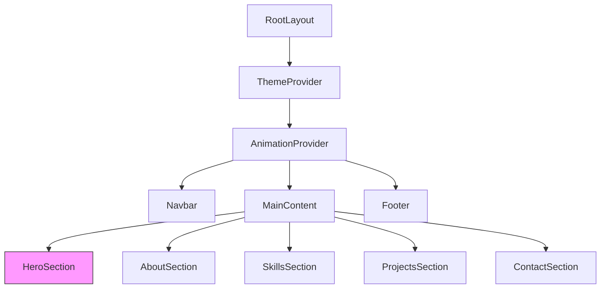

# Fullstack Developer Portfolio Website Design

## 1. Overview

This document outlines the design for a fullstack developer portfolio website featuring advanced animations using GSAP, Three.js, and Framer Motion. The website will showcase completed works, contact information, and skills with a focus on complex, non-geometric animations and a distinctive accent color (#74dde3).

### Objectives
- Create a visually impressive portfolio that showcases fullstack development skills
- Implement complex animations without geometric shapes
- Use a distinctive accent color (#74dde3) in dark theme tones
- Provide sections for projects, skills, and contact information
- Ensure responsive design and optimal performance

### Key Features
- Hero section with complex non-geometric animation
- Projects showcase with interactive elements
- Skills visualization with animated progress indicators
- Contact form with micro-interactions
- Theme toggle (dark/light mode) with smooth transitions
- Animation control panel for user preferences
- Parallax scrolling effects for depth perception
- Responsive design for all device sizes
- Performance-optimized animations
- Accessibility compliance with reduced motion options

## 2. Technology Stack

### Frontend
- **Framework**: Next.js 15 (App Router)
- **Language**: TypeScript
- **Styling**: Tailwind CSS
- **Animations**: 
  - GSAP for scroll-triggered and timeline animations
  - Three.js for complex 3D particle systems
  - Framer Motion for component-based animations
- **State Management**: React Context API

### Development Tools
- **Package Manager**: npm/pnpm/yarn
- **Linting**: ESLint with Next.js configuration
- **Testing**: Jest with React Testing Library (for critical components)

## 3. Component Architecture

### Component Hierarchy


### Core Components
1. **ThemeProvider** - Manages dark/light theme state
2. **AnimationProvider** - Manages animation settings and states
3. **Navbar** - Navigation with theme toggle and animation controls
4. **HeroSection** - Main landing section with complex Three.js animation
5. **AboutSection** - Personal introduction with timeline animations
6. **SkillsSection** - Visualization of technical skills with animated progress bars
7. **ProjectsSection** - Showcase of completed works with interactive cards
8. **ContactSection** - Contact form with animated feedback
9. **Footer** - Additional links and copyright

## 4. Animation System Design

### Animation Libraries Usage Plan
- **Three.js**: Complex particle systems in Hero section (non-geometric)
- **GSAP**: Scroll-triggered animations, timeline sequences, parallax effects
- **Framer Motion**: Component entrance animations, micro-interactions

### Animation Control Panel
- UI component for users to adjust animation intensity (Subtle, Moderate, Intense)
- Toggle to enable/disable all animations
- Settings persistence using localStorage

### Animation Context
A global AnimationContext will manage:
- Animation intensity settings (Subtle, Moderate, Intense)
- Animation enable/disable toggle
- Theme-aware color updates for animations

### Hero Section Animation
The Hero section will feature a complex, non-geometric particle system:
- Particle system with organic, fluid movements using Three.js
- Interactive particles that respond to cursor movement with attraction/repulsion physics
- Color palette based on accent color (#74dde3) with dynamic theme awareness
- Particles form conceptual patterns (energy fields, vortexes, fluid dynamics) rather than geometric shapes
- Low-opacity particle trails (0.1) for subtle visual effects
- Performance-optimized with requestAnimationFrame

### Section Transitions
- Fade in/out effects using Framer Motion with spring physics
- Staggered animations for list items with GSAP
- Scroll-triggered animations using GSAP ScrollTrigger
- Parallax effects for background elements
- Smooth page transitions between sections

### Parallax Implementation
- Multi-layer parallax backgrounds with different scroll speeds
- GSAP ScrollTrigger for precise parallax control
- Performance-optimized with transform3d for smooth animations
- Theme-responsive parallax elements

## 5. UI/UX Design

### Color Scheme
- **Primary Background**: Dark theme with deep grays (#0a0a0a to #1a1a1a)
- **Text**: Light grays (#ededed to #cccccc)
- **Accent Color**: #74dde3 (used for highlights, buttons, progress bars)
- **Progress Bars**: rgba(116, 221, 227, 0.8) (80% transparency)
- **Card Backgrounds**: Slightly lighter than primary background (#1a1a1a)

### Typography
- Primary font: Geist (via next/font)
- Secondary font: Geist Mono for code/technical elements
- Responsive font sizing using Tailwind's default scale
- Font weights: 300, 400, 500, 600, 700 for visual hierarchy

### Layout Structure
```
┌─────────────────────────────────────┐
│               Navbar                │
├─────────────────────────────────────┤
│               Hero                  │
├─────────────────────────────────────┤
│               About                 │
├─────────────────────────────────────┤
│               Skills                │
├─────────────────────────────────────┤
│              Projects               │
├─────────────────────────────────────┤
│              Contact                │
├─────────────────────────────────────┤
│               Footer                │
└─────────────────────────────────────┘
```

### Spacing System
- Consistent 8px grid system
- Section padding: 64px vertical, 24px horizontal (responsive)
- Component spacing: 16px-32px based on hierarchy
- Card padding: 24px with 16px gutters

## 6. Section Specifications

### Hero Section
- Full-screen introduction with animated Three.js background
- Name and tagline with entrance animations using Framer Motion
- Call-to-action buttons with hover effects and GSAP animations
- Complex Three.js particle system (non-geometric, organic movements)
- Theme-responsive animations with dynamic color updates
- Interactive elements with mouse tracking
- Scroll-down indicator with animated effects
- Multi-layer parallax background elements with varying scroll speeds

### About Section
- Personal introduction with animated profile image and 3D tilt effect
- Professional journey timeline with scroll animations using GSAP
- Key achievements with animated counters using Framer Motion
- Smooth entrance animations for all elements
- Interactive elements with hover effects
- Theme-responsive color scheme

### Skills Section
- Skill categories with animated progress bars using GSAP
- Skill level visualization using animated charts with Framer Motion
- Interactive elements with hover effects
- GSAP-powered staggered animations for skill items
- Theme-responsive color scheme with accent color (#74dde3)
- Skill category filtering with animated transitions

### Projects Section
- Project cards with hover effects and 3D tilt using GSAP
- Filter functionality for project categories with animated transitions
- Modal view for detailed project information with Framer Motion
- Entrance animations for card grid using staggered GSAP animations
- Interactive elements with micro-interactions
- Lazy loading for project images
- Parallax effect on project cards during scroll
- Project tags with animated filtering

### Contact Section
- Contact form with animated input fields and floating labels
- Social media links with hover animations using Framer Motion
- Map visualization (if applicable) with interactive markers
- Form validation with animated feedback and error states
- Submit button with loading animation using GSAP
- Success/error message animations
- Theme-responsive form elements

## 7. Data Models

### Project Model
```typescript
interface Project {
  id: string;
  title: string;
  description: string;
  technologies: string[];
  imageUrl: string;
  liveUrl?: string;
  githubUrl?: string;
  featured: boolean;
  date: string;
  category: string[];
}
```

### Skill Model
```typescript
interface Skill {
  id: string;
  name: string;
  level: number; // 0-100
  category: 'Frontend' | 'Backend' | 'Database' | 'DevOps' | 'Other';
}
```

### Contact Model
```typescript
interface ContactFormData {
  name: string;
  email: string;
  subject: string;
  message: string;
}
```

### Animation Settings Model
```typescript
interface AnimationSettings {
  intensity: 'subtle' | 'moderate' | 'intense';
  enabled: boolean;
}
```

## 8. Animation Implementation Details

### Three.js Particle System (Hero Section)
- Particle type: Organic circles (not squares) with variable sizes
- Interaction: Attraction/repulsion based on cursor proximity with physics
- Color scheme: Theme-aware using accent color (#74dde3) with smooth transitions
- Movement: Fluid, natural motion patterns with Brownian motion simulation
- Patterns: Energy fields, vortexes, or particle flows based on conceptual designs
- Performance: Optimized with WebGL and requestAnimationFrame
- Custom shaders for unique visual effects

### Parallax Effects Implementation
- GSAP ScrollTrigger for scroll-based parallax animations
- Multi-layer approach with foreground, middle-ground, and background elements
- Different scroll speeds for each layer to create depth perception
- requestAnimationFrame for smooth performance
- Mobile optimization with reduced intensity on touch devices

### GSAP Animations
- Scroll-triggered animations for section entrances
- Timeline sequences for complex multi-step animations
- Staggered animations for lists and grids
- Smooth scrolling behavior

### Framer Motion Animations
- Component mount animations
- Hover and tap effects for interactive elements
- Page transition animations
- Micro-interactions for form elements

## 9. Theme Management

### Theme Context
- Manages current theme (dark/light)
- Handles theme transition animations
- Provides theme values to components
- Persists theme preference in localStorage

### Theme-Aware Animations
- Animations adapt to current theme
- Color values update dynamically on theme change
- Uses CSS variables for consistent color management
- MutationObserver to detect theme changes for Three.js scenes
- Dynamic color updates for particle systems based on accent color (#74dde3)

## 10. Performance Considerations

### Animation Optimization
- Code splitting for animation libraries (GSAP, Three.js, Framer Motion)
- Lazy loading for non-critical animations
- Performance monitoring for complex Three.js scenes
- Fallbacks for low-performance devices
- RequestIdleCallback for non-essential animations

### Bundle Size Management
- Tree-shaking for animation libraries
- Dynamic imports for heavy components
- Preloading critical assets
- Image optimization for project showcases
- CDN delivery for animation assets

## 11. Responsive Design

### Breakpoints
- Mobile: 0px - 768px
- Tablet: 769px - 1024px
- Desktop: 1025px+

### Responsive Animations
- Reduced motion for accessibility (prefers-reduced-motion media query)
- Adaptive animation intensity based on device performance
- Touch-friendly interactive elements
- Optimized layouts for all screen sizes
- Mobile-first animation approach with progressive enhancement

### Performance Considerations
- Disable non-essential animations on mobile devices
- Reduce particle count in Three.js scenes on lower-end devices
- Implement animation frame rate monitoring
- Use CSS transforms and opacity for performant animations

## 12. Testing Strategy

### Component Testing
- Unit tests for core components using Jest and React Testing Library
- Snapshot tests for UI components
- Animation state tests
- Theme switching tests
- Animation performance tests

### Integration Testing
- Section interaction tests
- Form validation tests
- Navigation flow tests
- Animation sequence tests

### Performance Testing
- Animation frame rate monitoring (60fps target)
- Load time measurements
- Bundle size analysis
- Mobile performance testing
- Accessibility testing for reduced motion preferences

## 13. Deployment Considerations

### Hosting
- Recommended: Vercel (optimized for Next.js)
- Alternative: Netlify or similar static hosting

### Build Optimization
- Next.js automatic static optimization
- Image optimization with Next.js Image component
- Code splitting for animation libraries
- Minification and compression
- Preloading critical animation assets
- Caching strategies for static assets